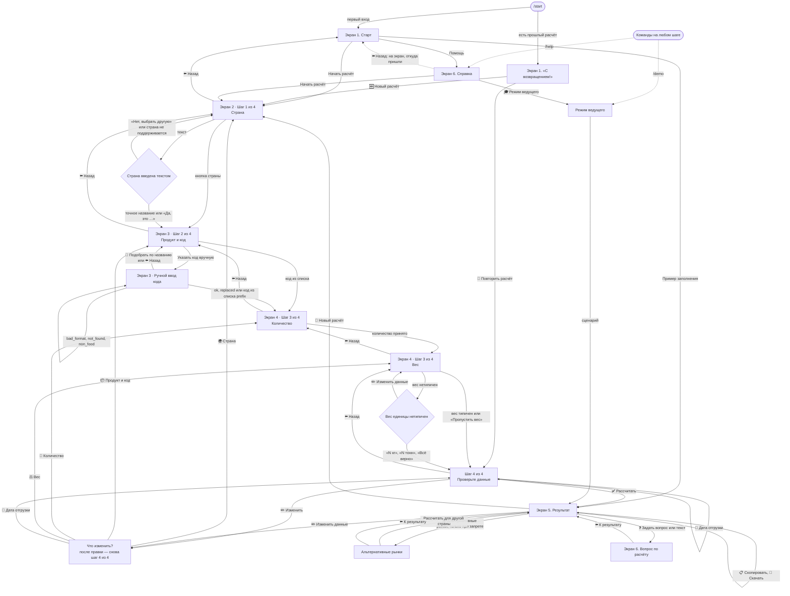

# Контракт экранов MAXimum Export

Этап 1.5: API, контракт экранов и тексты готовятся до того, как появятся макеты мини-приложения.
Основание — ТЗ: §14 (особые случаи), §15 (экраны), §16 (стиль, дисклеймер), §20 (где нужна проверка человека), §21 (критерии приёмки), §22 (сценарии).

## Кто читает этот документ

- **Дизайнер мини-приложения.** Здесь перечислены экраны, поля, данные и состояния, которые нужно нарисовать. Чек-лист состояний — в конце документа.
- **Разработчик чат-бота (этап 2) и разработчик мини-приложения (этап 3).** Здесь указано, какие ключи текстов и какие поля API использовать и куда ведёт каждая кнопка.
- **Ведущий тренинга.** Здесь описано, где видны нестандартные ситуации и как их показать (раздел «Режим ведущего»).

## Два фронтенда на одном ядре

Расчёт выполняет только ядро на Go. Оба фронтенда показывают его результат и сами ничего не считают.

| | Чат-бот в MAX | Мини-приложение в MAX |
|---|---|---|
| Ввод | Сообщения и инлайн-кнопки. Один вопрос за шаг. | Формы: поля, списки, переключатели. Один экран на шаг. |
| Ограничения | Сообщение не длиннее 4000 символов; отчёт режется на части по 3500 символов, это делает API. Кнопки идут по одной в ряд, подпись не длиннее 30 символов, иначе MAX её обрежет. | Длина не ограничена. Горизонтального скролла быть не должно. |
| Откуда берётся отчёт | `chat_parts[]` показываются как есть | `blocks[]`, `documents[]`, `duty`, `warnings[]`, `roles[]`, `stop` рисуются компонентами |
| «Скопировать» | `copy_text[]` отправляется отдельными сообщениями | Буфер обмена, текст из `copy_text[]` |
| «Скачать» | Файл `.txt` приходит в чат вложением | Ссылка `download_url` |
| Черновик расчёта | В памяти бота, отдельно для каждого пользователя | В памяти страницы; готовый расчёт открывается по `id` |
| Страна, введённая текстом | Распознаётся функцией ядра `MatchCountry` | Не бывает: страна выбирается только из списка |

§19 ТЗ: сессия не сохраняется между перезапусками бота. После перезапуска приветствие «С возвращением!» не показывается, а старый `id` расчёта возвращает 404 (текст `error.calc_not_found`).

## Где живут тексты

- Все тексты интерфейса лежат в **`texts/ru.json`**. Это плоский JSON вида `"ключ": "текст"`, тот же набор отдаёт `GET /api/v1/texts`. Писать строки прямо в коде или в макете нельзя: только ключи.
- **Чего нет в `ru.json`.** Этот текст вычисляет ядро и отдаёт API:
  - строки блоков отчёта (`blocks[].lines`) и их заголовки (`blocks[].title`);
  - предупреждения (`warnings[].text`) и текст запрета (`stop`);
  - формулы пошлины (`duty.lines`) и тексты ролей (`roles[]`);
  - ответы на вопросы;
  - названия стран и подписи к ним (`/countries`);
  - наименования и категории кодов (`/products`);
  - названия и описания сценариев режима ведущего (хранятся в ядре вместе со сценариями).
  
  Дисклеймер API тоже возвращает в поле `disclaimer`, он совпадает с `common.disclaimer`.
- **Группы ключей.** `common.*` — общие строки; `btn.*` — подписи кнопок; дальше группы по экранам: `start`, `country`, `product`, `code`, `qty`, `weight`, `review`, `result`, `ask`, `help`, `demo`. `error.*` — ошибки и служебные сообщения; `miniapp.*` — строки, которые нужны только мини-приложению (подписи полей, плейсхолдеры, состояния загрузки, пустые экраны, тосты).
- **Дословные цитаты ТЗ.** Если ТЗ даёт формулировку, в `ru.json` она стоит дословно, только `[…]` заменены на `{…}`. Менять такие строки можно лишь вместе с ТЗ.
- **Кнопки.** Подпись `btn.*` вместе с подставленными значениями не длиннее 30 символов. В мини-приложении эмодзи в начале подписи можно заменить иконкой, но слова должны остаться теми же.
- **Разметка.** В чате `**жирный**`: адаптер MAX превращает его в HTML, мини-приложение рисует `<strong>`. Переносы строк в `ru.json` записаны как `\n`.

### Подстановки `{…}`

| Подстановка | Что подставляется | Пример |
|---|---|---|
| `{country}`, `{flag}`, `{subtitle}` | Название, флаг и подпись страны из `/countries` | Китай, 🇨🇳 |
| `{regime}` | `country.regime.eaeu` или `country.regime.third` | ЕАЭС |
| `{input}` | Ввод пользователя, обрезанный до 40 символов | КНР |
| `{product}`, `{name}`, `{category}` | Наименование товара или кода и категория из справочника | Сахар-песок свекловичный |
| `{code}`, `{old}`, `{new}` | Код ТН ВЭД в виде `1701 12 100 0` — функция ядра `FormatCode`. Код не переносится внутри себя: в мини-приложении `white-space: nowrap` | 1701 12 100 0 |
| `{date}` | Дата в формате ДД.ММ.ГГГГ | 20.09.2026 |
| `{i}` | Номер варианта от 1 до 5 | 2 |
| `{n}` | Целое число с пробелами между разрядами | 5 000 |
| `{codes_word}`, `{tonnes_word}` | Форма слова из `common.code.*` или `common.tonne.*` (one, few, many), согласованная с числом; для дробных чисел берётся few | кода, тонн |
| `{unit}` | Единица, согласованная с `{n}`, — функция ядра `Unit()`; если у товара единицы нет — `common.unit.default` («ед.») | мешков, мешок |
| `{unit_many}` | Единица для вопроса «Сколько …?»: `unit.many` из справочника. Если это «тонн», подставляется `qty.unit_bulk`, если единица пустая — `qty.unit_default` | мешков; тонн (груз навалом) |
| `{value}` | Число, которое ввёл пользователь, в нашем формате | 250; 0,5 |
| `{kg}` | Килограммы **без** «кг» | 250 000 |
| `{weight}`, `{net}` | Вес строкой из ядра (`FormatKg`) | 250 000 кг (250 т) |
| `{per_unit}`, `{min}`, `{max}` | Вес одной единицы и типичный диапазон, кг, без «кг» | 0,005; 1–51 |
| `{step}`, `{total}`, `{step_name}` | Номер шага, число шагов (4) и название шага из `miniapp.stepper.*` | 2, 4, Продукт |
| `{kind}` | Вид персональных данных из ядра (`DetectPII`) | номер телефона |
| `{topic}` | Название темы ответа: `miniapp.result.nav.<topic>` | Пошлина |
| `{query}`, `{limit}`, `{who}`, `{term}` | Запрос поиска, лимит символов, поля документа | — |
| `{required}`, `{conditional}`, `{no}`, `{stop}`, `{warn}`, `{info}` | Счётчики документов и предупреждений | 3 |

Числа пишутся с пробелом между разрядами и десятичной запятой. Деньги — `625 000 ₽`.

## Карта переходов

Схема показывает чат. В мини-приложении «✏️ Изменить данные» на результате сразу открывает Экран 4 с заполненными полями, а «Изменить» у строки сводки на шаге 4 из 4 — нужный шаг; после него пользователь возвращается на сводку.

## Общие правила для всех экранов

| Правило | Чат | Мини-приложение | Ключи |
|---|---|---|---|
| Прогресс «Шаг N из 4» (§21) | Первая строка сообщения шага | Степпер из 4 шагов вверху экрана | `country.title`, `product.title`, `qty.title`, `review.title`; `common.step`, `miniapp.stepper.*`, `miniapp.a11y.step` |
| Сводка уже введённого (§15, экран 4; §16) | Строка под заголовком шага, начиная с шага 3 | Сворачиваемый блок над формой, начиная с шага 3 | `common.summary`, `product.context` |
| «⬅️ Назад» | На каждом шаге; возвращает на шаг назад, данные сохраняются | Кнопка «Назад» и системный жест «назад» | `btn.back`, `miniapp.btn.back` |
| Устаревшая кнопка | Кнопка из прошлого сообщения: показать `error.stale_button` и отправить текущий шаг заново. В payload кнопки хранится идентификатор шага. | — | `error.stale_button` |
| Защита от персональных данных (§17, §21) | Любой текст проверяет `DetectPII`. Если найдены ПД, сообщение не сохраняется, пользователь остаётся на том же шаге. | API отвечает ошибкой с `kind`; показать под полем | `error.pii`, `common.pii_note`, `miniapp.pii_hint` |
| Текст там, где ждём кнопку | Шаг 4 из 4 и выбор поля: `error.use_buttons` и снова кнопки. На экране результата текст считается вопросом (Экран 6). | — | `error.use_buttons` |
| Файл, фото, голосовое сообщение | `error.unsupported_message` | — | |
| Неизвестная команда | `error.unknown_command` | — | |
| Слишком длинный ввод | `error.too_long` (`{limit}`: 200 символов на полях, 500 на вопросе) | `maxlength` у поля | `error.too_long`, `ask.too_long` |
| Сбой, таймаут, лимит запросов (§21: ответ не дольше 5 с) | `error.generic`, `error.timeout`, `error.rate_limit` + `btn.retry` | `miniapp.state.server_error`, `miniapp.state.offline` + `miniapp.btn.retry` | |
| Загрузка | Индикатор «печатает…» в MAX; перед расчётом — `review.calculating` | Скелетон или спиннер с текстом, если ответа нет дольше 300 мс | `miniapp.state.*` |
| Учебные данные (§21) | Пометки «учебный курс» и «учебная ставка» уже есть в строках API | Бейдж `common.training_badge`; внизу `common.data_as_of`, а если расчёт выполнен по учебному курсу — ещё `common.training_rate` | |

---

## Экран 1. Старт

**Зачем.** Поздороваться, коротко объяснить, что умеет бот, и дать вход в расчёт (§15, экран 1).

### Чат

Сообщение: `start.welcome` ⏎ `start.countries` ⏎⏎ `start.hint` ⏎⏎ `common.pii_note`.

Кнопки по порядку:
1. `btn.start_calc` — Начать расчёт
2. `btn.example` — Пример заполнения
3. `btn.help` — Помощь
4. `btn.open_miniapp` — появится, когда у мини-приложения будет публичный HTTPS-адрес (этап 4). Тип кнопки — открытие мини-приложения из MAX Bot API; точный тип проверить на этапе 4. Вместе с кнопкой в конец сообщения добавляется строка `start.miniapp_hint`.

Меню команд бота: `/start` — `common.cmd.start`, `/help` — `common.cmd.help`, `/demo` — `common.cmd.demo`.

**Пользователь уже делал расчёт** (последний расчёт хранится в памяти бота). Вместо приветствия отправляется `start.returning` с данными последнего расчёта: `{product}`, `{country}`, `{date}`.

Кнопки: `btn.repeat_calc`, `btn.new_calc_start`.

### Мини-приложение

- **Шапка:** `common.bot_name`, `miniapp.header.subtitle`.
- **Текст:** `start.welcome`, `start.hint`.
- **Страны:** три чипа «флаг + название» из `GET /api/v1/countries`.
- **Кнопки:** основная `btn.start_calc`, дополнительные `btn.example` и `btn.help`.
- **Подвал:**
  - `common.disclaimer_short`;
  - `common.data_as_of` (дата из `GET /api/v1/meta`);
  - бейдж `common.training_badge`.
- **Возврат пользователя.** Если в памяти страницы есть `id` последнего расчёта и `GET /api/v1/calculations/{id}` отвечает 200, показать карточку `start.returning` с кнопками `btn.repeat_calc` и `btn.new_calc_start`. Если ответ 404, карточку не показывать; это не ошибка.
- **Открыто не из MAX** (нет данных MAX WebApp): показать баннер `miniapp.state.not_in_max`. Форма при этом продолжает работать — это нужно для отладки.

### Переходы

| Действие | Куда |
|---|---|
| Начать расчёт, 🆕 Новый расчёт | Экран 2 |
| Пример заполнения | Экран 5. Сразу выполняется расчёт по тестовым данным §9: `cn`, `1701121000`, 5 000 мешков, 250 000 кг. Сверху показывается `result.example_badge`. |
| Помощь | Экран 6 (справка) |
| 🔁 Повторить расчёт | Шаг 4 из 4 с данными прошлого расчёта. Если дата отгрузки уже прошла, она сбрасывается. |

---

## Экран 2. Шаг 1 из 4 — страна

**Зачем.** Выбрать страну. От неё зависит режим расчёта: ЕАЭС или третьи страны (§15, экран 2).

### Чат

Сообщение: `country.title` ⏎⏎ `country.line` × 3 ⏎⏎ `country.text_hint`.

Кнопки по порядку:
1. `btn.country` × 3 — в том порядке, в каком их вернул `/countries`: 🇨🇳 Китай, 🇦🇲 Армения, 🇰🇿 Казахстан
2. `btn.back`

Ответ после выбора: `country.selected` (лучше редактировать исходное сообщение, чтобы выбранная страна «подсветилась»).

Если страна введена текстом, её распознаёт функция ядра `MatchCountry`:

| Что ввели | Ответ | Кнопки |
|---|---|---|
| Точное название («Китай») | `country.selected`, дальше Экран 3 | — |
| Синоним, падеж или опечатка («КНР», «Казахтан») | `country.confirm` | `btn.country_yes`, `btn.country_no` |
| Страна не распознана («Турция») | `country.unsupported` | `btn.country` × 3, `btn.back` |
| Нажато «Нет, выбрать другую» | Снова сообщение шага | как в начале шага |

### Мини-приложение

- **Компонент:** три карточки-радиокнопки или сегментированный контрол. В каждой — флаг, название, подпись (`subtitle`) и бейдж режима: `country.regime.eaeu` или `country.regime.third` (из поля `eaeu`).
- **Данные:** `GET /api/v1/countries` → для каждой страны `id`, `name`, `flag`, `subtitle`, `eaeu`. Точные имена полей — в OpenAPI.
- **Подпись поля:** `miniapp.country.label`; подсказка `miniapp.country.hint`.
- **После выбора:** под карточками подсказка режима `country.regime_hint.eaeu` или `country.regime_hint.third`.
- **Кнопка «Далее»** (`miniapp.btn.next`) неактивна, пока страна не выбрана.
- **Неизвестная страна в параметре ссылки** (например, `?country=tr`): показать баннер `country.unsupported_short` и ничего не выбирать.

### Переходы

Страна выбрана или подтверждена → Экран 3. «Назад» → Экран 1.

---

## Экран 3. Шаг 2 из 4 — продукт и код ТН ВЭД

**Зачем.** Определить товар и его код: от кода зависят ставка пошлины и все требования (§15, экран 3).

### Чат: поиск по названию

Сообщение: `product.title` ⏎ `product.context` ⏎⏎ `product.prompt`.

Кнопки: `btn.manual_code`, `btn.back`.

Пользователь пишет текст. Сначала проверка `DetectPII`, потом поиск `GET /api/v1/products/search?q=`. Если текст похож на код (не меньше 4 цифр, `LooksLikeCode`), он обрабатывается как ручной ввод кода.

| Результат поиска | Сообщение | Кнопки по порядку |
|---|---|---|
| 0 кодов | `product.not_found` | `btn.manual_code`, `btn.back` |
| 1 код | `product.found_one` ⏎ `product.found_item` ⏎⏎ `product.choose` | `btn.code_choice`, `btn.manual_code`, `btn.back` |
| 2–5 кодов | `product.found` (`{codes_word}` из `common.code.*`) ⏎ `product.found_item` × N ⏎⏎ `product.choose` | `btn.code_choice` × N, `btn.manual_code`, `btn.back` |
| Больше 5 | `product.too_many` | `btn.manual_code`, `btn.back` |
| Справочник недоступен (§14.8; справочники вшиты в программу, поэтому только в режиме ведущего «Сбой справочника») | `error.tnved_unavailable` | `btn.retry`, `btn.manual_code`, `btn.back` |

Когда код выбран, отправляется `code.selected` ⏎ `code.auto_note` (§20.1) и начинается Экран 4.

### Чат: ручной ввод кода

Сообщение `code.prompt`, кнопки `btn.search_by_name`, `btn.back`. Код проверяет `GET /api/v1/products/{code}`:

| `status` | Сообщение | Кнопки или переход |
|---|---|---|
| `ok` | `code.selected` | → Экран 4 |
| `replaced` | `code.replaced` (`{old}`, `{new}`, `{date}`), затем `code.selected` для нового кода | → Экран 4, расчёт по новому коду |
| `prefix` (введено 4–9 цифр, подходящих кодов не больше 5) | `code.prefix` ⏎ `product.found_item` × N | `btn.code_choice` × N, `btn.search_by_name`, `btn.back` |
| `prefix`, подходящих кодов больше 5 | `code.prefix_too_many` | `btn.search_by_name`, `btn.back` |
| `bad_format` | `code.bad_format` | `btn.search_by_name`, `btn.back` |
| `not_found` | `code.not_found` | `btn.retry_code`, `btn.search_by_name`, `btn.back` |
| `non_food` | `code.non_food` (`{category}`) | `btn.retry_code`, `btn.search_by_name`, `btn.back` |
| `not_yet_valid` (код начнёт действовать позже, §14.1) | `message` из ответа (`code.not_yet_valid`: `{code}`, `{date}`, `{current}`) | `btn.retry_code`, `btn.search_by_name`, `btn.back` |
| Справочник недоступен (только режим ведущего) | `error.tnved_unavailable` | `btn.retry`, `btn.back` |

Если код введён вручную и не подходит к названию, которое пользователь вводил раньше, в отчёте появится предупреждение `CODE_MISMATCH`. На этом экране его не показываем.

### Мини-приложение

- **Переключатель режима:** «По названию» (`miniapp.product.mode.search`) или «Знаю код ТН ВЭД» (`miniapp.product.mode.code`).
- **Поиск по названию:**
  - Поле ввода с автодополнением: `miniapp.product.label`, `miniapp.product.placeholder`, `miniapp.product.hint`.
  - Запрос уходит, когда введено не меньше 2 букв и прошло 300 мс без ввода. Если букв меньше 2, показать `miniapp.product.min_chars`.
  - Пока идёт запрос — `miniapp.state.searching`.
  - Список до 5 кодов. В строке: код моноширинным шрифтом, наименование, категория мелким текстом.
  - Если кодов больше 5, над первыми пятью показать подсказку `product.too_many`.
  - Если ничего не найдено — пустое состояние `miniapp.state.empty_search` + `miniapp.state.empty_search_hint` и ссылка на режим «Знаю код».
- **Ввод кода:**
  - Поле с маской `#### ## ### #`, только цифры, от 4 до 10: `miniapp.code.label`, `miniapp.code.placeholder`, `miniapp.code.hint`.
  - Кнопка `miniapp.btn.check_code`, во время проверки — `miniapp.state.checking_code`.
  - Результат показывается под полем по таблице `status` выше:
    - `ok` — карточка кода;
    - `replaced` — информационный баннер, потом карточка нового кода;
    - `prefix` — список кодов для выбора;
    - остальные статусы — ошибка поля с текстом из `code.*`.
- **Карточка выбранного кода:**
  - заголовок `miniapp.code.selected`;
  - код, наименование, категория;
  - если код подобран по названию, подпись `code.auto_note`;
  - ссылка `miniapp.code.change`.
- **Данные:**
  - `GET /api/v1/products/search?q=` → список `{code, name, category}` и общее число найденного;
  - `GET /api/v1/products/{code}` → `status`, товар, старый код (для `replaced`), кандидаты (для `prefix`).

### Переходы

Код выбран → Экран 4. «Назад» → Экран 2.

---

## Экран 4. Шаг 3 из 4 — количество и вес

**Зачем.** Количество и вес нужны для специфической пошлины, проверки квот, числа контейнеров и проверки «вес единицы» (§15, экран 4).

### Чат: 3а — количество

Сообщение: `qty.title` ⏎ `common.summary` ⏎⏎ `qty.prompt` (подстановка `{unit_many}` описана в таблице подстановок).

Кнопки: `btn.back`.

| Что ввели | Ответ |
|---|---|
| Чисел нет | `error.no_number` |
| 0 или отрицательное число | `qty.error.non_positive` |
| Дробное число | `qty.error.not_int` |
| Нормальное число, в том числе «5000 мешков по 50 кг» | `qty.accepted` → 3б. Если единица указана словом («мешков»), в отчёте будет она. |

### Чат: 3б — вес

Сообщение: `weight.prompt` ⏎⏎ `weight.skip_hint`. Если в количестве был указан вес единицы («по 50 кг»), перед ними идёт строка `weight.suggested`.

Кнопки по порядку:
1. `btn.weight_suggested` — только если в количестве был указан вес единицы
2. `btn.skip_weight`
3. `btn.back` — возвращает к 3а

| Что ввели | Ответ |
|---|---|
| Чисел нет | `error.no_number` |
| 0 или отрицательное число | `weight.error.non_positive` |
| Нетто больше брутто («250000 / 260000») | `weight.error.net_gt_gross` |
| Нормальный вес | `POST /api/v1/checks/weight` → смотрим `atypical` и `tonnes_likely` (таблица ниже) |
| Нажато «Пропустить вес» | `weight.skipped` → Шаг 4 из 4 с весом 0. В отчёт ядро добавит `WEIGHT_SKIPPED` (§15). |

Проверка веса одной единицы (§14.4, §14.9; §22, сценарий 3):

| Результат проверки | Сообщение | Кнопки по порядку |
|---|---|---|
| Вес типичен | `weight.accepted` или `weight.accepted_net` | → Шаг 4 из 4 |
| `atypical`, `tonnes_likely` | `weight.atypical` ⏎ `weight.atypical_range` ⏎⏎ `weight.tonnes_question` | `btn.weight_kg`, `btn.weight_tonnes`, `btn.edit_data` |
| `atypical`, тонны не подходят | `weight.atypical` ⏎ `weight.atypical_range` ⏎⏎ `weight.confirm_hint` | `btn.weight_ok`, `btn.edit_data` |

- «N кг» или «Всё верно» — пользователь подтвердил вес (`unit_weight_confirmed = true`) → Шаг 4 из 4.
- «N тонн» — вес умножается на 1000 и снова проверяется → Шаг 4 из 4.
- «✏️ Изменить данные» — снова 3б. Страна, код и количество сохраняются (§22: «без потери страны и кода»).
- Если единица указана явно («5 кг», «5 т»), вопрос про тонны не задаётся (`explicit_unit`).

Пример из §22: 1 000 мешков муки и вес «5». Ядро получает 0,005 кг на мешок. Бот показывает «⚠️ Указанный вес одной единицы (0,005 кг) нетипичен для «Мука пшеничная». Проверьте данные.» и спрашивает «Вы указали 5 — это 5 кг или 5 тонн?».

### Мини-приложение

Один экран с формой. Над формой — сворачиваемая сводка `common.summary`.

| Поле | Тип и проверки | Тексты |
|---|---|---|
| Количество | Целое число больше 0; после поля — единица (`{unit_many}`) | `qty.label`, `miniapp.qty.placeholder`, `miniapp.qty.hint`; ошибки `qty.error.*`, `error.no_number` |
| Вес брутто | Число больше 0, допускается запятая; рядом переключатель `кг`/`т` (`miniapp.weight.unit.*`), по умолчанию кг. Выбор «т» считается явной единицей. | `weight.label`, `miniapp.weight.placeholder`; ошибки `weight.error.*` |
| Вес нетто | Необязательное число больше 0, не больше брутто | `miniapp.weight.net_label`, `miniapp.weight.net_hint`, `weight.error.net_gt_gross` |
| Вес пока неизвестен | Чекбокс; выключает поля веса | `miniapp.weight.skip_label`, `weight.skip_hint` |

- **Подсказка на лету:** под весом `miniapp.weight.per_unit` и `miniapp.weight.typical`. Диапазон берётся из ответа `/checks/weight` или из данных товара.
- **По кнопке «Далее»:** вызывается `POST /api/v1/checks/weight`. Если вес нетипичен, под полем веса появляется карточка-предупреждение: `weight.atypical` + `weight.atypical_range` и чипы `btn.weight_kg` / `btn.weight_tonnes` (когда `tonnes_likely`) или `btn.weight_ok`. После выбора чипа переход на шаг 4.
- **Ошибка на всю форму** (API отклонил и количество, и вес): `error.non_positive` (§14.9).

### Переходы

Количество и вес приняты (или включено «Вес пока неизвестен») → шаг 4 из 4. Ошибка → остаёмся на экране, фокус на первом поле с ошибкой. «Назад» → Экран 3, введённые значения сохраняются. Если экран открыт для правки из сводки или из результата, «Далее» возвращает на сводку шага 4 из 4.

---

## Шаг 4 из 4. «Проверьте данные» (добавлен в прототипе)

**Зачем.** ТЗ нумерует шаги «из 4», но описывает только три шага ввода. Четвёртый шаг — проверка перед расчётом:
- на нём работает кнопка «Изменить» (§21);
- на нём вводится необязательная дата отгрузки (нужна для §14.1 и §14.3);
- кнопка «Рассчитать» перенесена сюда с экрана 4.

### Чат

Сообщение — карточка из строк:
- `review.title`
- `review.row.country`
- `review.row.product`
- `review.row.code`
- `review.row.qty`
- одна из строк веса: `review.row.weight`, `review.row.weight_net` или `review.row.weight_none`
- одна из строк даты: `review.row.date` или `review.row.date_none`
- `review.hint` (после пустой строки)

Кнопки по порядку:
1. `btn.calculate`
2. `btn.ship_date`
3. `btn.edit`
4. `btn.back`

| Действие | Что происходит |
|---|---|
| ✅ Рассчитать | Бот отправляет `review.calculating` и вызывает `POST /api/v1/calculations` → Экран 5. Ошибка 400 `invalid_input` или `personal_data` → показать `error.message` и вернуться к шагу по `error.field` (см. «Ошибки API» ниже). 429 → `error.rate_limit`. 5xx → `error.calc_failed` + `btn.retry`. Таймаут → `error.timeout`. |
| 📅 Дата отгрузки | `review.date_prompt`; кнопки `btn.clear_date` (если дата уже задана) и `btn.back`. Ответы: `review.date_error`, `review.date_past`, `review.date_too_far` (дальше 2 лет), `review.date_saved`, `review.date_removed` → снова карточка. В API дата передаётся как `ship_date` в формате ГГГГ-ММ-ДД; ошибка формата — `error.bad_iso_date`. |
| ✏️ Изменить | `review.edit_prompt`; кнопки `btn.edit_country`, `btn.edit_product`, `btn.edit_qty`, `btn.edit_weight`, `btn.edit_date`, `btn.back`. Открывается нужный шаг, после него — снова карточка, остальные данные не меняются. Если поменялось количество или вес, вес единицы проверяется заново. Смена страны сохраняет код, смена продукта сбрасывает код. |
| ⬅️ Назад | Шаг 3б (вес) |

### Мини-приложение

- **Карточка-сводка:** строки `review.row.*`, у каждой ссылка `miniapp.review.edit`. Ссылка открывает нужный шаг, после него — возврат на сводку.
- **Дата отгрузки:** необязательное поле-календарь (`miniapp.date.label`, `miniapp.date.placeholder`, `miniapp.date.hint`); прошедшие даты недоступны; ошибки `review.date_error`, `review.date_past`.
- **Основная кнопка** — текст `btn.calculate`.
- **Во время расчёта** — полноэкранный скелетон результата с текстом `miniapp.state.calculating` (§21: не дольше 5 с).
- **Ошибки:** `error.calc_failed`, `miniapp.state.server_error`, `miniapp.state.offline` + `miniapp.btn.retry`.

---

## Экран 5. Результат расчёта

**Зачем.** Главный экран: требования, документы, пошлина, роли и риски. Блоки идут в фиксированном порядке, внизу дисклеймер (§15, экран 5; §16; §21).

### Данные: `POST /api/v1/calculations` или `GET /api/v1/calculations/{id}`

| Поле | Что это | Где используется |
|---|---|---|
| `id` | Идентификатор расчёта | Вопросы, отчёт `.txt`, повторное открытие |
| `params` | Параметры сделки (страна, продукт, код, количество, вес, даты) | Шапка результата, `ask.header`, `result.download_caption` |
| `blocks[{id,title,lines}]` | Блоки в фиксированном порядке: `params`, `stop` (только при запрете), `packaging`, `product`, `labeling`, `documents`, `lab`, `duty`, `roles`, `warnings` | Мини-приложение; в чате уже внутри `chat_parts` |
| `documents[{name,status,who,term,note}]` | Чек-лист документов; `status`: `required`, `conditional`, `no` | Чек-лист в мини-приложении |
| `duty{type,rate_text,lines,total_rub,fee_rub,…}` или `null` | Пошлина; `null`, если экспорт запрещён (`stop`). `type`: `none`, `advalorem`, `specific`, `combined`. Ещё, по OpenAPI: признак ЕАЭС, `complete` (хватило ли веса), `winner`, валюта и курс, `fee_basis`, учебная ли ставка | Карточка пошлины |
| `warnings[{code,level,icon,text}]` | Предупреждения ядра; `level`: `info` ℹ️, `warn` ⚠️, `stop` 🚫 | Список предупреждений |
| `roles[]` | Строки для 5 ролей: `director`, `manager`, `customs`, `accountant`, `export_control`; пусто при `stop` | Вкладки ролей |
| `stop` | Запрет экспорта (`{code,level,icon,text}`) или `null`. Если не `null`: `duty` = `null`, `documents` и `roles` пустые, в `blocks` нет блоков требований, а `warnings` — только оставшиеся при запрете | Баннер 🚫 и кнопка «Альтернативные рынки» |
| `disclaimer` | Дисклеймер из §16, совпадает с `common.disclaimer` | Последняя строка |
| `chat_parts[]` | Отчёт для чата: уже с заголовком «Результат расчёта», метками «(1/2)», «(2/2)» и дисклеймером в конце последней части | Чат |
| `copy_text[]` | Короткая версия без разметки, без ролей и без ℹ️; части не длиннее 4000 символов (лимит сообщения MAX) | «📋 Скопировать отчёт» |
| `download_url` | Адрес `GET /api/v1/calculations/{id}/report.txt` | «📄 Скачать отчёт» |

Коды предупреждений. Текст всегда приходит из API, уровень задаёт ядро:

| Код | Уровень | Случай из ТЗ |
|---|---|---|
| `EXPORT_BAN` | 🚫 `stop` | §14.2: вывоз запрещён. Текст приходит в поле `stop`, по нему рисуется баннер запрета |
| `IMPORT_BAN` | ⚠️ `warn` | §14.2: страна назначения запретила ввоз |
| `QUOTA` | ⚠️ `warn` | §14.2: экспортная квота |
| `CODE_REPLACED` | ⚠️ `warn` | §14.1: код заменён (введён устаревший код или замена вступает в силу до даты отгрузки), расчёт по новому коду |
| `CODE_NOTE` | ℹ️ `info` | Справочная пометка к коду из справочника |
| `CODE_MISMATCH` | ⚠️ `warn` | §14.4: код не соответствует введённому типу продукции |
| `BORDERLINE` | ⚠️ `warn` | §14.7: товар на границе двух кодов |
| `COMPONENT` | ⚠️ `warn` | §14.7: компонент с отдельными ограничениями |
| `REGISTRATION` | ⚠️ `warn` | §14.3, §20.4: регистрация производителя (GACC, реестр ЕАЭС) |
| `CERT_NOT_RECOGNIZED` | ⚠️ `warn` | §14.3: сертификат ЕАЭС не признаётся |
| `LAB_TIME` | ⚠️ `warn` | §14.3: испытания не успеть до отгрузки (только если указана дата отгрузки) |
| `UNIT_WEIGHT` | ⚠️ `warn` | §14.4: вес единицы нетипичен, пользователь подтвердил вес |
| `GROSS_NET` | ⚠️ `warn` | §14.4: доля тары нетипична (только если указан вес нетто) |
| `WEIGHT_SKIPPED` | ⚠️ `warn` или ℹ️ `info` | §15, экран 4: вес пропущен. ⚠️ — если вне ЕАЭС установлена пошлина (строка уже есть в карточке пошлины), иначе ℹ️ |
| `REEFER` | ⚠️ `warn` | §14.6: температурный режим перевозки |
| `TRANSIT` | ℹ️ `info` | §14.6: маршрут и транзит |
| `CONTAINERS` | ℹ️ `info` | §14.10: партия больше одного 20-футового контейнера |
| `SMALL_BATCH` | ℹ️ `info` | §14.10: партия меньше 100 кг |
| `RATE_FAILED` | ⚠️ `warn` | §14.8: курс недоступен, взят последний известный |
| `RATE_JUMP` | ⚠️ `warn` | §14.5: курс резко изменился с прошлого расчёта |
| `RATE_VALIDITY` | ⚠️ `warn` | §14.1, §20.2: ставка действует на дату расчёта |
| `DATA_STALE` | ⚠️ `warn` | §14.1: могли вступить в силу новые требования |
| `PROFILE_FALLBACK` | ⚠️ `warn` | §14.8: профиль требований страны недоступен |
| `HUMAN_CHECK` | ℹ️ `info` | §20: что обязательно проверяет специалист |

При запрете экспорта в отчёте остаются только предупреждения, которые относятся к запрету: `CODE_NOTE`, `CODE_REPLACED`, `IMPORT_BAN`, `DATA_STALE`, `HUMAN_CHECK`.

По коду фронтенд решает только одно: куда вести ссылку «подробнее». Сам текст предупреждения фронтенд не меняет.

### Чат

1. Если расчёт открыт из «Пример заполнения», первым идёт сообщение `result.example_badge`.
2. Затем по одному сообщению на каждый элемент `chat_parts[]`, без изменений.
3. Под последней частью кнопки по порядку:
   1. `btn.copy`
   2. `btn.download`
   3. `btn.new_calc`
   4. `btn.edit_data`
   5. `btn.ask`
   6. `btn.alt_markets` — только если `stop` не пустой

| Кнопка | Что происходит |
|---|---|
| 📋 Скопировать отчёт | Каждый элемент `copy_text[]` уходит отдельным сообщением без разметки, после них `result.copy_hint`. Под последним сообщением кнопки результата отправляются заново: пользователь остаётся на экране. |
| 📄 Скачать отчёт | Файл `report.txt` вложением с подписью `result.download_caption`. Если отправить не удалось — `result.download_failed`. |
| 🔄 Новый расчёт | Черновик очищается → Экран 2 |
| ✏️ Изменить данные | В чате нельзя показать поле с уже заполненным значением, поэтому открывается выбор поля, как у «✏️ Изменить» на шаге 4 из 4 (`review.edit_prompt`). Кнопки «🔢 Количество» и «⚖️ Вес» — это и есть Экран 4 из ТЗ. После правки — снова шаг 4 из 4. Данные сохраняются (§15, §22). |
| ❓ Задать вопрос | Экран 6 в режиме вопроса |
| 🌍 Альтернативные рынки | `result.alt.intro`; кнопки `btn.calc_for` для каждой другой страны из `/countries` и `btn.back_to_result`. Нажатие запускает новый расчёт с тем же товаром, количеством и весом → Экран 5. Если все страны закрыты — `result.alt.none`. |
| Пользователь пишет текст | Текст считается вопросом по расчёту (Экран 6) |

### Мини-приложение

Порядок элементов сверху вниз:

1. **Шапка.**
   - `result.title` и дата расчёта `miniapp.result.date`.
   - Бейдж `common.training_badge`, если в расчёте есть учебные ставки или учебный курс.
   - Если открыт пример — баннер `result.example_badge`.
2. **Параметры сделки.** Блок `params` в виде компактной карточки.
   - При прокрутке сверху прилипает строка `common.summary` (§16: «чтобы не листать вверх»).
   - Сворачивание: `miniapp.result.params_toggle`.
3. **Баннер запрета** (если `stop` не пустой).
   - Во всю ширину, иконка 🚫, заголовок `result.stop_title`.
   - Текст `stop` из API, ниже `result.stop_hint`, кнопка `btn.alt_markets`.
   - Блоки `packaging` … `roles` API в этом случае не присылает, их места не рисуем.
4. **Навигация по блокам.** Чипы `miniapp.result.nav.<id>` — только для блоков, которые пришли. Чипы переносятся на вторую строку, горизонтального скролла нет.
5. **Упаковка, продукция, маркировка** (`packaging`, `product`, `labeling`). Заголовок из `blocks[].title`, строки — маркированным списком (§16: списки, не абзацы).
6. **Документы** (`documents[]`) — чек-лист.
   - Над списком строка `miniapp.result.docs_summary`.
   - В строке: название, бейдж статуса, «кто выдаёт» (`miniapp.result.doc_who`), срок (`miniapp.result.doc_term`), примечание `note` мелким текстом.
   - Бейджи статуса:
     - `required` → `result.doc_status.required` (акцентный цвет);
     - `conditional` → `result.doc_status.conditional` (нейтральный цвет, условие — в `note`);
     - `no` → `result.doc_status.no` (приглушённый).
   - Статус передаётся словом и цветом, не только цветом.
   - Порядок — как пришёл из API.
7. **Лабораторные испытания** (`lab`). Список; последняя строка — ориентировочный срок.
8. **Карточка пошлины** (`duty`).
   - **ЕАЭС:**
     - крупно «0 ₽», заголовок `result.duty.eaeu_title`;
     - строки НДС, декларация, курс `result.duty.fx_not_needed` — из строк блока `duty`;
     - кратко — `result.duty.eaeu_summary`.
   - **Вне ЕАЭС**, строки с подписями `result.duty.label.*`:
     - тип ставки (`result.duty.type_name.<type>`);
     - ставка (`rate_text`, при учебной ставке — бейдж `result.duty.training`);
     - формулы из `duty.lines`: подпись и формула, цифры моноширинным шрифтом;
     - **итого к уплате** (`total_rub`) — крупно, под ним `winner` для комбинированной ставки;
     - таможенный сбор (`fee_rub`);
     - всего таможенных платежей;
     - курс;
     - НДС;
     - декларация.
   - **Не хватило веса** (`complete = false`): вместо «Итого» — плашка `result.duty.no_weight`.
   - **Курс получить не удалось** (`RATE_FAILED`): под строкой курса — `result.duty.rate_failed`.
9. **Роли** (`roles[]`).
   - Пять вкладок `result.role.<id>` и подсказка `miniapp.result.roles_hint`.
   - На узком экране вместо вкладок — выпадающий список или чипы в две строки, без горизонтального скролла.
   - По умолчанию открыт «Директор по ВЭД».
10. **Внимание** (`warnings[]`).
    - Сводка `miniapp.result.warnings_summary`.
    - Список отсортирован по уровню: 🚫, ⚠️, ℹ️.
    - У каждого предупреждения иконка `icon` и текст `text`; для экранного диктора — подпись уровня `result.level.<level>`.
    - Если нет ни одного 🚫 и ⚠️ — показать `miniapp.result.no_critical`.
    - Длинный список: сначала 5, дальше `miniapp.btn.show_all` / `miniapp.btn.collapse`.
11. **Дисклеймер** `disclaimer`. Виден всегда, не сворачивается. Рядом `common.data_as_of`; если расчёт выполнен по учебному курсу — `common.training_rate` (§20.6).
12. **Нижняя закреплённая панель действий.**
    - Основные: `btn.copy`, `btn.download`, `btn.ask`.
    - В меню «ещё»: `btn.new_calc`, `btn.edit_data`.
    - При запрете — `btn.alt_markets`.
    - Тосты: `miniapp.toast.copied`, `miniapp.toast.copy_failed`, `miniapp.toast.download`, `miniapp.toast.download_failed`.
    - В WebView MAX скачивание может быть запрещено. Тогда открыть `download_url` в новом окне; если и это не работает — тост `miniapp.toast.download_failed`.
    - «Изменить данные» открывает Экран 4 с уже заполненными полями.

### Особые состояния (§15, экран 5; §14)

| Состояние | Что приходит из API | Чат | Мини-приложение |
|---|---|---|---|
| ЕАЭС: Армения, Казахстан (§13, сценарий 1; §22, сценарии 2–3) | В `duty` признак ЕАЭС, `total_rub = 0` | Строки блока пошлины в `chat_parts` | Карточка ЕАЭС: `result.duty.eaeu_title` |
| Экспорт запрещён (§14.2) | `stop` не пустой, блок `stop`, `EXPORT_BAN` | Блок 🚫 в `chat_parts` + кнопка `btn.alt_markets` | Баннер 3, кнопка `btn.alt_markets` |
| Альтернативные рынки | `GET /api/v1/countries`, затем новый `POST /api/v1/calculations` с другой страной | `result.alt.intro` + `btn.calc_for` × N + `btn.back_to_result`; если все страны закрыты — `result.alt.none` | Нижняя панель с карточками стран (`btn.calc_for`) или `result.alt.none` |
| Страна запретила ввоз (§14.2) | `IMPORT_BAN` (⚠️) | Входит в блок «Внимание» | Список «Внимание» |
| Курс недоступен (§14.8) | `RATE_FAILED` | Строка в блоке пошлины | `result.duty.rate_failed` |
| Вес не указан (§15) | `WEIGHT_SKIPPED`, `complete = false` | Строка в блоке пошлины | `result.duty.no_weight` |
| Квота (§14.2) | `QUOTA` | В блоке «Внимание» | Список «Внимание» |
| Код заменён (§14.1) | `CODE_REPLACED` | В блоке «Внимание» | Список «Внимание» |
| Профиль страны недоступен (§14.8) | `PROFILE_FALLBACK` | В блоке «Внимание» | Список «Внимание» |
| Данные устарели (§14.1) | `DATA_STALE` | В блоке «Внимание» | Список «Внимание» |
| Расчёт не найден (перезапуск, §19) | 404 | `error.calc_not_found` + `btn.new_calc` | То же, пустое состояние |
| Пример заполнения | Обычный расчёт | `result.example_badge` | Баннер `result.example_badge` |

---

## Экран 6. Справка и вопрос по расчёту

**Зачем.** Короткая инструкция по полям и коду ТН ВЭД, частые вопросы и вопросы по готовому отчёту (§15, экран 6).

### Справка: чат

Одно сообщение, около 2 700 символов:
- `**help.title**` ⏎ `help.intro`;
- шесть статей, каждая после пустой строки: `**help.article.<id>.title**` ⏎ `help.article.<id>.text`.

Статьи по порядку: `tnved`, `find_code`, `incoterms`, `countries`, `zero_duty`, `code_not_found`.

Кнопки по порядку:
1. `btn.back` — на экран, откуда пришли; бот помнит предыдущий экран
2. `btn.start_calc`
3. `btn.demo`

Команда `/help` открывает этот экран с любого шага, «Назад» возвращает на тот же шаг.

### Справка: мини-приложение

- **Статьи:** аккордеон из 6 пунктов: заголовок `help.article.<id>.title`, текст `help.article.<id>.text`. Данные — `GET /api/v1/help` (те же ключи). Домен `customs.gov.ru` в тексте сделать ссылкой.
- **Кнопки:** `miniapp.btn.back`, `btn.start_calc`, ссылка `btn.demo`.

### Вопрос по расчёту

Открывается кнопкой «❓ Задать вопрос» или текстом на экране результата.

**Чат.**
- Сообщение: `ask.header` ⏎ `ask.examples`; кнопки `btn.back_to_result`, `btn.help`.
- Каждый вопрос уходит в `POST /api/v1/calculations/{id}/questions {question}` → `{text, topic, topic_id, found, suggestions}`.
- Ответ: `text` целиком — он уже содержит заголовок темы, ответ по отчёту и `ask.footer`. `ask.topic` отдельно не добавляется.
- `found = false` — тема не распознана: `text` = `ask.not_found`, показать подсказки.
- Кнопки после ответа: первые 3 подсказки из `suggestions` (API присылает до 5, каждая не длиннее 30 символов) и `btn.back_to_result`.
- Пока ответ готовится — `ask.thinking` или индикатор «печатает…».

**Мини-приложение.**
- Нижняя панель поверх результата.
- Сверху `ask.header`, чипы-подсказки.
- Поле `miniapp.ask.placeholder`, подсказка `miniapp.ask.hint`, кнопка `miniapp.btn.send`; закрыть панель — `miniapp.btn.close`.
- Ответы — пузырями. Подпись `ask.topic` (`{topic}` = поле `topic`) — ссылка, которая прокручивает отчёт к блоку по `topic_id`: `documents`, `lab`, `labeling`, `packaging`, `product` совпадают с `blocks[].id`; `duty`, `vat`, `rate` → блок `duty`; `registration`, `restrictions`, `logistics`, `terms` → блок `warnings`.

| Состояние | Ключ |
|---|---|
| Пустой вопрос | `ask.empty` |
| Длиннее 500 символов | `ask.too_long` (`{limit}` = 500) |
| Ответа в отчёте нет | `ask.not_found` + `suggestions` |
| Расчёта нет (бот перезапускался) | `ask.no_calc` + `btn.start_calc` |
| В вопросе персональные данные | `error.pii` |

---

## Режим ведущего (`/demo`)

**Зачем.** Ведущий показывает нестандартные сценарии без ручного ввода (§21: 5 сценариев без сбоев).

- **Чат.** Сообщение `demo.title` ⏎ `demo.intro`, по кнопке на сценарий, затем `btn.back`. Сценарий сразу открывает Экран 5.
- **Мини-приложение.** Список карточек сценариев. Вход — из справки (`btn.demo`).
- **Где хранятся названия сценариев.** В ядре, вместе с самими сценариями (этап 5), а не в `ru.json`.
- **Что показать (минимум):**
  - сценарии 1–3 из §22;
  - запрет вывоза (рис-сырец → Китай);
  - квота (пшеница → Китай);
  - устаревший код (йогурт, код до 2022 г.);
  - сбой курса (`RATE_FAILED`);
  - нетипичный вес (мука: 1 000 мешков, вес «5» → Казахстан);
  - недоступный профиль страны (`PROFILE_FALLBACK`);
  - устаревшие данные (`DATA_STALE`).

---

## Ошибки API

Все ошибки приходят в одном формате: `{"error": {"code", "field", "kind", "message"}}`. Поле `message` — готовый текст для пользователя.

| HTTP | `error.code` | Когда | Что показать |
|---|---|---|---|
| 400 | `invalid_input` | Данные не прошли проверку (ноль, отрицательный или слишком большой вес, неизвестная страна, неверный код, дата в прошлом, поле длиннее 200 символов) | `message` под полем `field`; в чате — вернуться к нужному шагу |
| 400 | `personal_data` | В тексте найдены персональные данные (телефон, e-mail, ИНН, номер договора); `kind` — что именно | `message` (= `error.pii`), поле не сохранять |
| 400 | `bad_json` | Некорректный JSON или неизвестное поле | `error.generic` |
| 404 | `not_found` | Расчёт не найден: хранится 24 часа и теряется при перезапуске | `error.calc_not_found` + «Новый расчёт» |
| 413 | `too_large` | Тело запроса больше 64 КБ | `error.body_too_large` |
| 429 | `rate_limited` | Больше 60 POST-запросов в минуту с одного адреса; заголовок `Retry-After` | `error.rate_limit` |
| 500 | `internal` | Внутренняя ошибка | `error.generic` + «Повторить» |

Ограничения полей: текстовые поля (`q`, `code`, `product_query`, `unit_word`) — до 200 символов, вопрос — до 500; количество — от 1 до 1 000 000 000; вес — больше 0 и до 1 000 000 000 кг; нетто — только вместе с брутто и не больше него.

## Доступность, планшет и ноутбук (§21)

**Общее:**
- Кнопки и строки списков высотой не меньше 48 px, между соседними целями нажатия не меньше 8 px. На телефоне основная кнопка во всю ширину, на планшете — не шире 480 px.
- Без горизонтального скролла:
  - ширина контента не больше 720 px, по центру экрана;
  - уже 600 px таблицы превращаются в карточки;
  - длинные строки (стандарты «GB 4806.1-2016», названия документов) переносятся;
  - код ТН ВЭД и суммы не переносятся внутри себя (`white-space: nowrap`).
- Основной текст не меньше 16 px, подписи не меньше 14 px, межстрочный интервал 1,4. Итоговая сумма пошлины и заголовки блоков крупнее основного текста.
- Статус никогда не передаётся одним цветом: всегда иконка и слово (бейджи документов, уровни предупреждений). Контраст — не ниже AA (4,5:1). Нужна поддержка светлой и тёмной темы MAX.
- Экранный диктор:
  - эмодзи в заголовках скрыты от диктора (`aria-hidden`), рядом есть текстовая подпись;
  - прогресс шагов озвучивается как `miniapp.a11y.step`;
  - кнопки действий подписаны `miniapp.a11y.copy` и `miniapp.a11y.download`.
- Порядок фокуса совпадает с визуальным. Если поле не прошло проверку, фокус переходит на первую ошибку.
- Если ответа нет дольше 300 мс, показывать индикатор загрузки. Через 10 с считать запрос неудачным (`error.timeout`).

**Только чат:**
- Кнопки по одной в ряд, подпись не длиннее 30 символов.
- Сообщение не длиннее 3500 символов (ограничение MAX — 4000).
- Меньше длинных абзацев, больше маркированных списков (§16).

---

## Чек-лист для дизайнера: какие состояния нарисовать

Нарисовать для ширины 360 px (телефон), 768 px (планшет, портретная ориентация) и 1024 px (планшет, альбомная ориентация, или ноутбук), в светлой и тёмной теме.

**Старт**
- [ ] Первый вход
- [ ] «С возвращением!»
- [ ] Открыто не из MAX (`miniapp.state.not_in_max`)
- [ ] Загрузка текстов и стран

**Шаг 1 — страна**
- [ ] Ничего не выбрано, кнопка «Далее» неактивна
- [ ] Выбран Китай: подсказка режима «Третьи страны»
- [ ] Выбрана Армения или Казахстан: подсказка «ЕАЭС»
- [ ] Баннер `country.unsupported_short`

**Шаг 2 — продукт и код**
- [ ] Пустое поле
- [ ] Меньше 2 букв
- [ ] Идёт поиск
- [ ] Найдено 1 код
- [ ] Найдено от 2 до 5 кодов
- [ ] Найдено больше 5 кодов (подсказка `product.too_many`)
- [ ] Ничего не найдено
- [ ] Режим «Знаю код»: пустое поле и проверка кода
- [ ] Статусы кода: `ok`, `replaced` (баннер ℹ️), `prefix` (список), `bad_format`, `not_found`, `non_food`
- [ ] Справочник ТН ВЭД недоступен
- [ ] Карточка выбранного кода с пометкой §20.1

**Шаг 3 — количество и вес**
- [ ] Пустая форма
- [ ] Заполненная форма с подсказкой «≈ N кг на единицу»
- [ ] Ошибки: не число, 0 или минус, дробное количество, нетто больше брутто
- [ ] Предупреждение «нетипичный вес» с чипами «кг / тонн»
- [ ] Предупреждение «нетипичный вес» с кнопкой «Всё верно»
- [ ] Включён «Вес пока неизвестен»
- [ ] Сводка свёрнута и развёрнута

**Шаг 4 из 4**
- [ ] Сводка без даты
- [ ] Сводка с датой
- [ ] Открыт календарь
- [ ] Ошибки даты
- [ ] Идёт расчёт (скелетон)
- [ ] Ошибка расчёта
- [ ] Таймаут

**Результат**
- [ ] Китай, сахар: все блоки, пошлина 0 %, формулы
- [ ] Китай, специфическая или комбинированная ставка: формулы и `winner`
- [ ] ЕАЭС, мёд → Армения: карточка ЕАЭС
- [ ] Запрет (рис-сырец → Китай): баннер 🚫 и альтернативные рынки
- [ ] Панель «Альтернативные рынки»: выбор другой страны и вариант «все страны закрыты» (`result.alt.none`)
- [ ] Страна запретила ввоз (`IMPORT_BAN`, ⚠️ в списке «Внимание»)
- [ ] Вес не указан (`result.duty.no_weight`)
- [ ] Сбой курса (`result.duty.rate_failed`)
- [ ] Много предупреждений: квота, регистрация, рефрижератор, контейнеры; свёрнуто и развёрнуто
- [ ] Роли: вкладки и вариант для узкого экрана
- [ ] Чек-лист документов со всеми тремя статусами
- [ ] Режим примера
- [ ] Шапка: дата расчёта, бейдж «Учебные данные»; прилипшая строка сводки при прокрутке
- [ ] Дисклеймер и пометка об учебном курсе внизу
- [ ] Тосты «скопировано» и «ошибка скачивания»
- [ ] Закреплённая панель действий
- [ ] Расчёт не найден (404)

**Вопрос по расчёту**
- [ ] Пустая панель с подсказками
- [ ] Ответ с темой
- [ ] Ответ не найден
- [ ] Ошибка «персональные данные»
- [ ] Идёт ответ

**Справка**
- [ ] Аккордеон свёрнут
- [ ] Одна статья раскрыта
- [ ] Кнопки «Назад», «Начать расчёт», ссылка «Режим ведущего»

**Режим ведущего**
- [ ] Список сценариев
- [ ] Сценарий открыт: результат с нужным предупреждением

**Общие состояния**
- [ ] Нет сети
- [ ] Ошибка сервера
- [ ] Ошибка «персональные данные» под полем

---

## Критерии приёмки §21 → экраны

| Критерий §21 | Где выполняется | Как проверить |
|---|---|---|
| Выбор 3 стран с правильным режимом (ЕАЭС / не ЕАЭС) | Экран 2; карточка пошлины на Экране 5 | Китай → пошлина по коду; Армения и Казахстан → `result.duty.eaeu_title` |
| Тип продукции и код ТН ВЭД: подбор из справочника и ручной ввод | Экран 3 | Поиск «сахар-песок»; ввод «1701121000»; статусы кода |
| Проверка веса и количества: нули, минусы, несоответствия, неподдерживаемые страны | Экраны 2 и 4 | `qty.error.*`, `weight.error.*`, `weight.atypical`, `country.unsupported` |
| Пошлина: тип ставки, формула, итог; «0 ₽» для ЕАЭС | Экран 5, карточка пошлины | Строки `duty.lines`, `total_rub` |
| Полный путь для Китая: все блоки и дисклеймер | Экраны 1 → 2 → 3 → 4 → «4 из 4» → 5 | §22, сценарий 1 |
| Полный путь для ЕАЭС: нулевая пошлина, статистическая форма, требования ЕАЭС | То же | §22, сценарии 2 и 3 |
| 5 и больше нестандартных ситуаций без зависаний, с понятными ⚠️ / 🚫 | Экран 5 («Внимание», баннер 🚫); Экраны 3 и 4; `/demo` | Режим ведущего |
| «Шаг N из 4», «Назад», «Изменить», «Скопировать» работают | Заголовки шагов; `btn.back`, `btn.edit`, `btn.edit_data`, `btn.copy` | Пройти путь туда и обратно |
| Результат структурирован, блоки в фиксированном порядке; длиннее 3500 символов — делится на части | Экран 5: `blocks[]`, `chat_parts[]` | Отчёт по Китаю (сахар) приходит в трёх частях с метками «(1/3)» … «(3/3)», каждая не длиннее 3500 символов |
| Читается на планшете и ноутбуке: крупные кнопки, без горизонтального скролла | Раздел «Доступность» | Ширина 768 и 1024 px |
| Ответ не дольше 5 с; 20 расчётов подряд без сбоев | Все экраны: состояния загрузки и таймаут | Тест ядра `TestTwentyCalculationsFast`; ручной прогон |
| Персональные данные не запрашиваются | Во всех формах нет полей для ПД; `error.pii`, `common.pii_note` | Отправить телефон или ИНН → предупреждение, сообщение не сохранено |
| Учебные данные помечены, на каждом результате дисклеймер | Экран 5: `common.training_badge`, `result.duty.training`, `disclaimer` | Визуально |
| Путь «старт → результат» не дольше 3 минут | 4 шага, около 8 нажатий; «Пример заполнения» | Засечь время |
| Пользователь отвечает на 3 из 4 контрольных вопросов по содержанию | Экран 5: блоки «Сертификаты», «Пошлина», «Внимание»; Экран 6: «❓ Задать вопрос» | Вопросы из §22: «Какие сертификаты?», «Сколько пошлина?», «Сколько ждать регистрацию?» |
| Для 5 ролей есть минимум 1 блок | Экран 5, блок и вкладки ролей (`roles[]`) | Пять вкладок с текстом |
| Ведущий показывает 5 сценариев | Режим ведущего | `/demo` |

## Отличия от ТЗ и открытые вопросы

1. **Добавлен шаг 4 из 4 «Проверьте данные».** Кнопка «Рассчитать» перенесена туда с экрана 4 (ТЗ считает шаги «из 4», но описывает три).
2. **Кнопка даты отгрузки называется `📅 Дата отгрузки (по желанию)`, а не «(необязательно)».** Вариант «(необязательно)» получается длиннее 30 символов.
3. **«✏️ Изменить данные» из результата в чате открывает выбор поля.** В мини-приложении эта кнопка открывает Экран 4 с заполненными полями.
4. **Приветствие `start.welcome` начинается с «MAXimum Export —», а не с «МАКС —», как в ТЗ:** «МАКС» легко спутать с названием мессенджера. Решение команды от 22.09.2026.
5. **Для веса единицы добавлена кнопка «✅ Всё верно».** Она нужна, когда вариант «в тоннах» не подходит, а пользователь уверен в весе. Поле `unit_weight_confirmed` для неё в ядре уже есть.
6. **«📋 Скопировать отчёт» может прийти двумя сообщениями.** ТЗ просит одно сообщение, но у полных расчётов (§22, сценарии 1–3) версия без оформления бывает длиннее 4000 символов (лимит сообщения MAX), поэтому `copy_text[]` может содержать две части. Сократить копию до одного сообщения — задача этапа 2.
